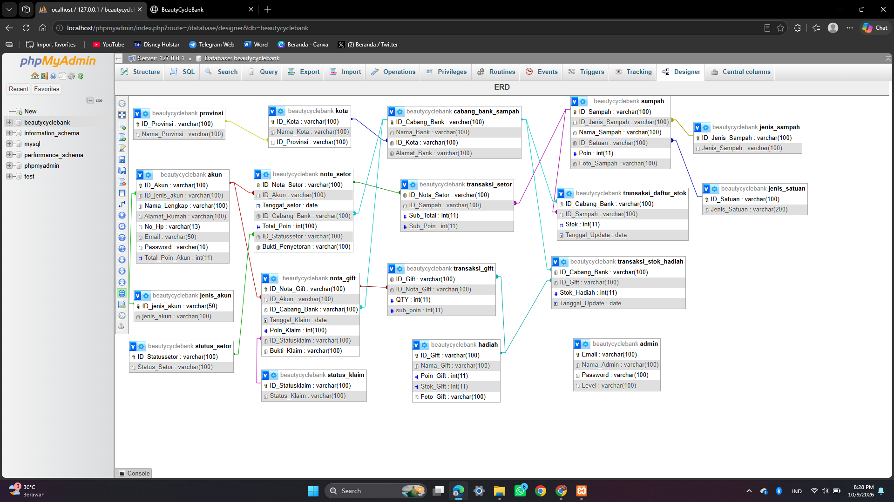

# ♻️ BeautyCycleBank Website

**BeautyCycleBank** is a web-based application designed to facilitate online waste deposit activities and support waste management through a digital platform. The website aims to provide users with a convenient way to access waste deposit services and encourage more organized waste management practices.

This project demonstrates the implementation of a dynamic website using PHP and MySQL, focusing on digital waste management services.

---

## 📌 Project Overview

BeautyCycleBank is an online waste deposit platform that aims to make waste collection and deposit activities more accessible through a website.

The system provides a digital interface for waste deposit-related activities, helping users access information and interact with the services provided by the platform.

The project was developed using **PHP, MySQL, HTML, CSS, and JavaScript** and can be run locally using **XAMPP**.

---

## ✨ Features

The BeautyCycleBank website is designed to support online waste deposit activities and waste management services. Update this list to match the functionality implemented in the application.

- ♻️ **Waste Management Information**  
  Provides information related to waste management and waste deposit services.

- 🏠 **Homepage**  
  Introduces the BeautyCycleBank platform and its main services.

- 👤 **User Registration and Login**  
  Allows users to access the platform through user authentication.
  
- 📦 **Online Waste Deposit**  
  Supports submitting waste deposit information through the website.

- 📋 **Deposit Information Management**  
  Organizes waste deposit-related information within the system.

- 🔐 **User Authentication**  
  Supports access to features based on user login status.

---

## 🛠️ Tech Stack

| Technology | Purpose |
|------------|---------|
| **PHP** | Backend and server-side logic |
| **MySQL** | Database management |
| **HTML** | Website structure |
| **CSS** | Website styling and layout |
| **JavaScript** | Client-side interaction |
| **XAMPP** | Local development environment |
| **phpMyAdmin** | MySQL database management |
| **Git & GitHub** | Version control and project repository |

---

## 📂 Project Structure

The project contains PHP files and supporting resources used to build the website, manage application logic, and display its interface.

```text
Beautycycyclebank_website/
├── *.php
├── css/
├── js/
├── images/
├── assets/
├── database/
└── README.md
```

> The structure above is illustrative. Adjust it according to the actual files and folders in the repository.

---

## ⚙️ Requirements

Before running this project, make sure the following software is installed:

- [XAMPP](https://www.apachefriends.org/)
- PHP
- MySQL
- phpMyAdmin
- A web browser
- Git (optional, if cloning the repository)

---

## 🚀 Installation & Setup

### 1. Clone the Repository

Clone the repository to your local machine:

```bash
git clone https://github.com/indhmrsyaa/Beautycycyclebank_website.git
```

Alternatively, download the repository as a ZIP file from GitHub.

### 2. Move the Project to XAMPP

Move the project folder into the XAMPP `htdocs` directory.

Example:

```text
C:\xampp\htdocs\Beautycycyclebank_website
```

### 3. Start XAMPP

Open the **XAMPP Control Panel** and start the following services:

- Apache
- MySQL

These services are required to run the PHP application and connect to the MySQL database.

### 4. Set Up the Database

Open phpMyAdmin in your browser:

```text
http://localhost/phpmyadmin
```

Create a database using the name expected by the application.

Select the database, then import the SQL file provided in the repository:

```text
Database/beautycyclebank.sql
```
Click Import, choose the beautycyclebank.sql file, and click Import or Go to execute the SQL file and create the required database tables.

### 5. Configure the Database Connection

Locate the PHP file responsible for connecting to the database and configure the connection according to your local environment.

Example configuration:

```php
$host = "localhost";
$username = "root";
$password = "";
$database = "beautycyclebank";
```

If your local MySQL configuration uses different credentials or a different database name, update the settings accordingly.

### 6. Run the Website

After starting Apache and MySQL, open the following URL in your browser:

```text
http://localhost/Beautycycyclebank_website/
```

The application should be accessible locally, provided the database and configuration have been set up correctly.

---

## 🗄️ Database

BeautyCycleBank uses MySQL as its database management system to store and manage application data.

The database structure is provided in the Database/beautycyclebank.sql file, which can be imported into phpMyAdmin during project setup.

### ERD Database

The Entity Relationship Diagram (ERD) illustrates the database structure and the relationships between tables used in the BeautyCycleBank website.




Make sure the database configuration in the PHP files matches your local environment.

---

## 🖥️ Website Preview

Add screenshots of your actual website to showcase its interface and functionality.

### Homepage


### Login Page


### User Interface


### Admin Interface 


---

## 🎯 Project Objectives

The main objectives of developing BeautyCycleBank are:

- To develop a web-based platform for online waste deposit activities.
- To apply PHP for server-side web development.
- To integrate a website with a MySQL database.
- To provide a digital interface for waste management-related services.
- To practice frontend and backend web development.
- To explore how digital technology can support more accessible waste management services.

---

## 📚 Learning Outcomes

Through this project, the following web development concepts were explored:

- PHP programming
- MySQL database integration
- HTML and CSS implementation
- JavaScript interaction
- Dynamic website development
- User authentication, if implemented
- Database management using phpMyAdmin
- Local server configuration using XAMPP
- Version control using Git and GitHub

---

## 👩‍💻 Author

**Indah Marsya Fitadea**

GitHub: [@indhmrsyaa](https://github.com/indhmrsyaa)

---
